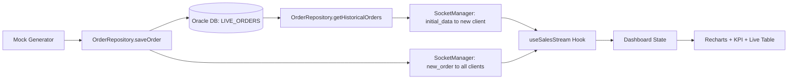

<<<<<<< HEAD
# Real-Time Sales Dashboard


A production-minded monorepo for real-time sales monitoring, built with a clean backend architecture and a responsive frontend analytics experience.

## Overview

**Real-Time Sales Dashboard** provides live operational visibility for sales streams with a robust event pipeline and fast UI hydration.

This project solves key real-time dashboard challenges:

- **Instant first render** with historical hydration from Oracle.
- **Continuous live updates** via Socket.IO delta events.
- **Race-condition resilience** using the **Hydrate from History, then Stream Delta** pattern.
- **Clean maintainable code** through Repository Pattern and custom hook composition.

The result is a dashboard that starts with meaningful historical context and keeps updating in near real-time without data gaps.

## Key Features

- **Monorepo architecture** with clear separation of concerns (`/backend`, `/frontend`).
- **Node.js + Express + Socket.IO backend** for real-time event delivery.
- **Oracle-backed persistence** with connection pooling and repository abstraction.
- **Repository Pattern**:
  - `BaseRepository` centralizes transaction and connection lifecycle logic.
  - `OrderRepository` focuses on domain SQL only.
- **Hydrate + Delta flow**:
  - Client receives `initial_data` snapshot on connect.
  - Server continues broadcasting `new_order` deltas globally.
- **React + Vite + Tailwind + Recharts frontend** with responsive, dark-themed UI.
- **Custom Hooks composition**:
  - `useBaseWebSocket` manages transport lifecycle.
  - `useSalesStream` manages domain stream state.
- **Bounded in-memory stream window** to control client memory growth.

## Architecture & Data Flow

### High-level Flow

1. Mock order is generated in backend stream loop.
2. Order is persisted into Oracle (`LIVE_ORDERS`).
3. Server emits `new_order` to all connected clients.
4. On new client connection, backend fetches history and emits `initial_data` only to that socket.
5. Frontend hydrates state from `initial_data`, then appends `new_order` deltas.
6. UI updates KPI cards, chart, and live table.

### Diagram



## Prerequisites

Install and configure the following before running:

- **Node.js** 20+
- **npm** (comes with Node.js)
- **Oracle Database** (Oracle XE / Oracle DB instance)
- **Oracle SQL Developer** (recommended for query validation and schema checks)

## Environment Variables

### Backend (`backend/.env`)

```env
PORT=5000

ORACLE_USER=your_oracle_username
ORACLE_PASSWORD=your_oracle_password
ORACLE_CONNECTION_STRING=localhost/XEPDB1
```

### Frontend (`frontend/.env`)

```env
VITE_SOCKET_URL=http://localhost:5000
```

## Installation & Running

### 1. Clone and enter repository

```bash
git clone <your-repo-url>
cd Dashboard_Ver1
```

### 2. Install backend dependencies

```bash
cd backend
npm install
```

### 3. Install frontend dependencies

```bash
cd ../frontend
npm install
```

### 4. Start backend (Terminal A)

```bash
cd backend
npm run dev
```

### 5. Start frontend (Terminal B)

```bash
cd frontend
npm run dev
```

### 6. Open the app

- Frontend: `http://localhost:5173`
- Backend health check: `http://localhost:5000/health`

## Folder Structure

```text
Dashboard_Ver1/
|-- backend/
|   |-- server.js
|   |-- package.json
|   `-- src/
|       |-- config/
|       |   `-- db.js
|       |-- repositories/
|       |   |-- BaseRepository.js
|       |   `-- OrderRepository.js
|       |-- services/
|       |   `-- mockDataGenerator.js
|       |-- sockets/
|       |   `-- SocketManager.js
|       `-- utils/
|           `-- constants.js
|
|-- frontend/
|   |-- package.json
|   `-- src/
|       |-- App.tsx
|       |-- components/
|       |   |-- charts/
|       |   |-- common/
|       |   `-- tables/
|       |-- hooks/
|       |   |-- useBaseWebSocket.js
|       |   `-- useSalesStream.js
|       `-- utils/
|           |-- constants.js
|           `-- formatters.ts
|
`-- local-embed-test/
    |-- index.html
    `-- server.js
```

## Why This Design

This project deliberately favors **clarity, reliability, and extensibility**:

- Backend data access logic is centralized for consistency and safer Oracle lifecycle handling.
- Frontend stream consumption is encapsulated and reusable across future dashboard pages.
- Hydration + delta architecture enables both fast startup UX and robust real-time continuity.

## Future Enhancements

- Server-side KPI snapshots and analytics endpoints.
- AuthN/AuthZ and role-based dashboard views.
- Observability (metrics/tracing) for stream throughput and DB latency.
- Automated tests for repository and socket stream behavior.

---

Built with care for clean architecture and real-time reliability.
=======
# websocket-sales-monitor
A production-ready real-time sales dashboard built with Node.js, React, Socket.io, and Oracle Database. Features 'hydrate from history &amp; stream delta' architecture for seamless live data rendering.
>>>>>>> 77ded2bf1f66d82bb0302a28f11b551c60bc089d
